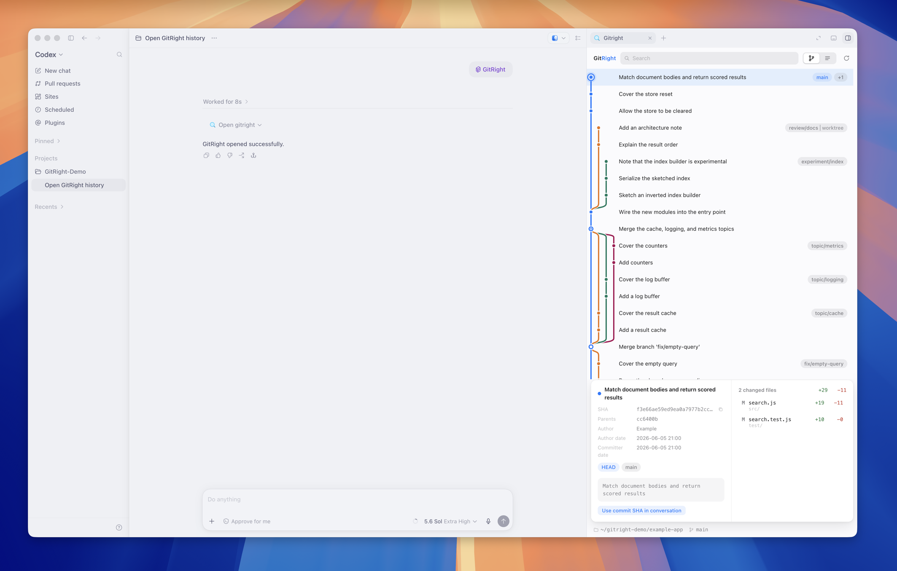
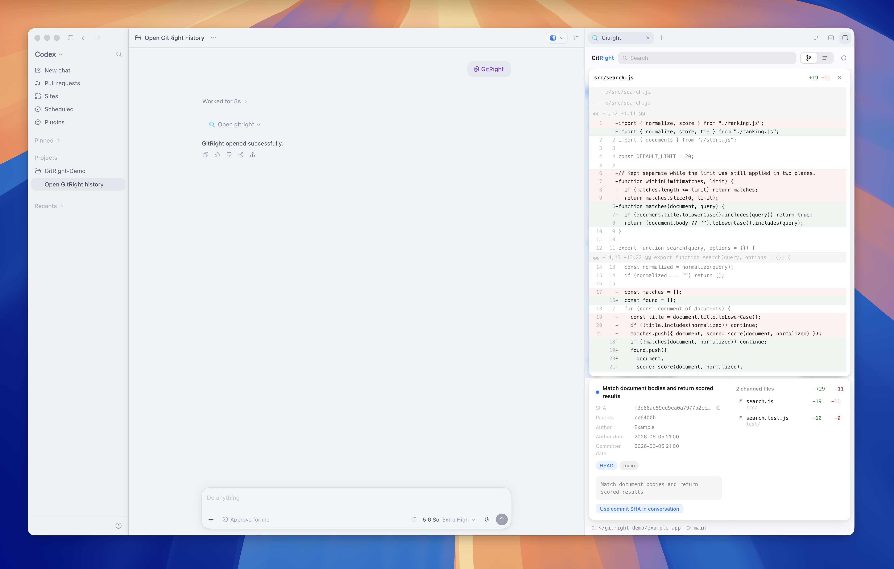

# GitRight

[English](./README.md) | 日本語

GitRight は Codex 用の読み取り専用 Git 履歴ビューアです。現在のタスクに紐づいたリポジトリを右ペインで開き、グラフ形式もしくはテキスト形式の Git 履歴、コミット詳細、変更ファイル、上限つきのファイル差分を表示します。  
Git 履歴はキーワードで検索可能です。

GitRight はベータ版です。インターフェースやインストール方法はベータリリースの間で変わることがあります。



## 動作条件

- macOS（Apple silicon `arm64`）
- プラグインとフルスクリーン MCP Apps に対応した Codex
- Git 2.30.0 以降
- Bun ランタイム (`>=1.3.14 <2.0.0`)

GitRight は Bun を同梱・ダウンロード・インストール・更新しません。GitRight を起動する前に、対応する Bun 1.x を[公式のインストール手順](https://bun.sh/docs/installation)に従って導入してください。

ベータのサポート範囲全体は [Compatibility](./docs/compatibility.md) を参照してください。

## インストール

GitRight のベータ marketplace を追加してプラグインをインストールします。

```sh
codex plugin marketplace add hashi-yu/gitright --ref beta --json
codex plugin add gitright@gitright-beta --json
```

1 つの Git リポジトリに紐づいた Codex タスクを開き、Codex に GitRight を開くよう依頼するか、GitRight プラグインを選択します。GitRight は右ペインを要求し、そのタスクのリポジトリで利用可能な履歴を読み込みます。

marketplace の操作とプラグインのインストールはネットワークを使用しますが、前提条件の準備とインストールが終わったあとは、初回起動を含めて GitRight のランタイムはネットワークにアクセスしません。

## アップグレード

`gitright-beta` marketplace を登録済みの場合は、先に Git スナップショットを更新してから、もう一度プラグインをインストールします。

```sh
codex plugin marketplace upgrade gitright-beta --json
codex plugin add gitright@gitright-beta --json
```

更新の手順を省くと、`codex plugin add` は最新のベータリリースではなく、以前に取得したスナップショットを再インストールします。インストールと同じく、アップグレードもネットワークを使用します。

## 使い方

1 つの Git リポジトリに紐づいた Codex タスクを開いて GitRight を起動すると、右ペインにそのリポジトリの利用可能な履歴が読み込まれます。

- ヘッダーの切り替えでグラフ表示とテキスト表示を選択可能です（上の画像はグラフ表示）。
- 読み込み済みのコミットを件名・SHA・ref で検索し、マッチを順に辿れます。
- コミットを選ぶとコミットシートが開きます。SHA、親、作成者、日時、ref、コミットメッセージ、そのコミットの変更ファイルが表示されます。
- 変更ファイルを選ぶと統合差分が開きます。差分を閉じると変更ファイル一覧に戻ります。
- マージコミットでは、変更ファイルをどの親と比較するかを選べます。
- リポジトリが変わったあとは更新ボタンを押すことで履歴を読み込み直します。



コミットを選んだりファイルを閲覧したりしても、会話には何も送られません。明示的に引き渡す（Use commit SHA in conversation）ことで会話に選択したコミットの完全な SHA を引き渡すことが出来ます。

## トラブルシューティング

準備中です。

## プライバシーと安全性

GitRight は読み取り専用の Git 操作だけを使います。リポジトリ、作業ツリー、Git の設定、フック、認証情報を変更しません。リポジトリの内容はアプリの表示面の中に留まります。コミットを選んだり閲覧したりしても会話には送られず、明示的な引き渡しで選択したコミットの完全な SHA だけが共有されます。

Codex のモデル通信は GitRight のランタイムのネットワーク境界の外にあり、オンラインのままである場合があります。

## ベータのサポート

再現手順のあるバグ報告と機能提案を GitHub Issues で歓迎します。サポートはベストエフォートで、返信・解決・マージ・ロードマップの期限はありません。ベータでは GitHub Discussions、直接のサポート、メールでのサポートは提供しません。

セキュリティ上の懸念やインシデントは公開 Issue に書かないでください。[Security Policy](./SECURITY.md) と [Code of Conduct](./CODE_OF_CONDUCT.md) に従ってください。コントリビューターは [Contributing](./CONTRIBUTING.md) を読んでください。

## ドキュメント

- [Architecture](./docs/architecture.md)
- [Architecture decision records](./docs/adr/)
- [Compatibility](./docs/compatibility.md)
- [Development](./docs/development.md)
- [Verification](./docs/verification.md)

ドキュメントは英語のみです。README の内容は英語版が正で、日本語版はその翻訳です。差異がある場合は英語版が優先されます。

## ライセンス

GitRight は [MIT License](./LICENSE) で利用できます。

GitRight は Git Project および Software Freedom Conservancy とは無関係で、これらの承認を受けたものではありません。
